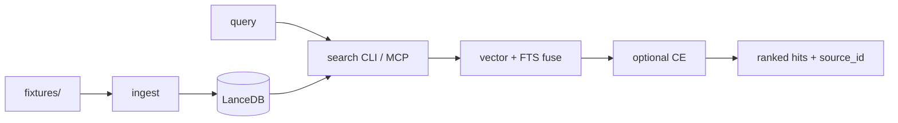

# AI Knowledge Base

Keep coding agents current. Local-first **hybrid RAG**: embed → vector + keyword search → fuse ranks → optional cross-encoder → **CLI** and **MCP** tools.

**This repo is the public portfolio surface.** Demo data is synthetic `fixtures/` only. A private sibling may hold personal YouTube transcripts — that corpus is **not** here.

| Start here | Link |
|------------|------|
| Clone + smoke | [`GETTING_STARTED.md`](GETTING_STARTED.md) |
| Interview FAQ | [`INTERVIEW.md`](INTERVIEW.md) |
| Docs map | [`docs/README.md`](docs/README.md) |
| Contracts | [`docs/ARCHITECTURE.md`](docs/ARCHITECTURE.md) |
| Packaging intent | [`docs/PORTFOLIO_VISION.md`](docs/PORTFOLIO_VISION.md) |

### Honesty (first minute)

- **Public demo = fixtures.** No personal tips, no OEM manuals, no auto-sync on clone.
- **Cross-encoder stays in the stack** for completeness + degrade path — **no claimed hit@K lift** on the fixture eval ([`docs/2026-07-12_ce_keep_note.md`](docs/2026-07-12_ce_keep_note.md)).
- **Eval-complete marketing claim is parked** until stronger discriminative evidence exists. Build packaging is done; do not invent lift.
- **MCP default is read-only.** Mutations need an explicit private profile flag.

**License:** MIT — [`LICENSE`](LICENSE).

## What you get

- **Hybrid retrieval:** LanceDB vector + FTS → RRF-style fusion → optional MiniLM cross-encoder  
- **Local embeddings:** Ollama `nomic-embed-text` @ 768 (not Gemma, not mxbai)  
- **Agent tools:** MCP `search`, `discover`, `get_context`, `get_status`  
- **Optional BYO path:** ignored `channels.local.json` + short YouTube backfill — not required for smoke  

## Quick Start

```bash
uv sync
ollama pull nomic-embed-text
uv run python -m src.ingest --fixtures
uv run python -m src.search "reciprocal rank fusion RRF" --hybrid --db data/lancedb
uv run python -m src.eval
```

Full footguns and MCP wiring: [`GETTING_STARTED.md`](GETTING_STARTED.md).

## How it fits together



## Features

- **Vector search:** Semantic search via local Ollama embeddings (`nomic-embed-text` @ 768 — **not** Gemma)
- **Hybrid search:** Vector + FTS → fusion → optional pluggable CE
- **Fixture-first smoke:** Committed synthetic fixtures; no personal corpus required
- **Optional BYO sync:** Local YouTube channel sync via ignored overlay (not required for demo)
- **Discovery:** Honest browse / digest / concepts / channel grouping (not a clustering product)
- **100% local:** Ollama + LanceDB on your machine

## Architecture

```
ai-knowledge-base-public/
├── fixtures/                 # Public synthetic corpus + provenance + golden eval
├── data/                     # Local/ignored raw + LanceDB (not committed)
├── src/
│   ├── config.py             # Settings (nomic embeddings; N/K/CE; BACKFILL_DAYS=7)
│   ├── embed.py              # Ollama embeddings (nomic-embed-text)
│   ├── identity.py           # source_id / content_hash / embedding_version
│   ├── ingest.py             # Chunk + fixture/YouTube ingest + FTS
│   ├── search.py             # Shared retrieval spine (CLI)
│   ├── rerank.py             # Pluggable local CE adapter
│   ├── mcp_server.py         # RO public MCP (mutations behind private flag)
│   ├── discover.py           # Browse / digest / concepts / channel groups
│   ├── youtube_sync.py       # Optional BYO YouTube sync
│   └── eval/                 # Fixture golden eval
└── docs/
    └── README.md             # Docs map (SSOT vs working notes)
```

## Stack

| Component | Tool | Notes |
|-----------|------|-------|
| Vector DB | LanceDB | File-based; hybrid FTS + vector |
| Embeddings | Ollama + **nomic-embed-text** | 768 dims; **≠ gemma**; ≠ mxbai |
| Rerank (optional) | MiniLM CE via sentence-transformers | Degrade to fusion if CE fails; no lift claim |
| Transcripts | yt-dlp | Optional BYO sync path only |

## Usage

### Search
```bash
# Semantic search
uv run python -m src.search "best practices for MCP servers"

# Hybrid search (keyword + semantic → fusion → optional CE)
uv run python -m src.search "Claude Code hooks" --hybrid

# Disable CE for this call
uv run python -m src.search "RAG techniques" --hybrid --no-ce

# Show more results
uv run python -m src.search "RAG techniques" --limit 20
```

### Discovery
```bash
# Channel grouping (honest label — not embedding clustering)
uv run python -m src.discover clusters

# What's new this week
uv run python -m src.discover digest --since 7d

# Random exploration
uv run python -m src.discover random

# Top concepts mentioned (heuristic term counts)
uv run python -m src.discover concepts
```

### YouTube Sync (optional / local)
```bash
# Sync configured channels (new videos only) — uses ignored channels.local.json
uv run python -m src.youtube_sync

# Force re-check all channels
uv run python -m src.youtube_sync --force
```

Personal channel mutation via MCP is **off** on the public profile. Persist channels by editing ignored `channels.local.json` (not committed `src/config.py`).

## Public default vs private overlay

| Surface | Public / stranger default | Local / optional |
|---------|---------------------------|------------------|
| Channels | Committed `YOUTUBE_CHANNELS = []` | Ignored `channels.local.json` |
| Fixture smoke | Works with empty channels | Not required |
| Sync / launchd | Not required; no auto-sync on clone | Optional macOS private ops |

```bash
# Optional: copy example → ignored overlay, then edit handles
cp channels.local.example.json channels.local.json
# never commit channels.local.json
```

`get_status` reports `tracked_channels: 0` without an overlay. Launchd plist (`scripts/com.aikb.youtube-sync.plist`) is a template — replace `REPLACE_WITH_REPO_ROOT` with your clone path before `launchctl load`; macOS-only; not required for fixture smoke.

## MCP Server (AI Agent Integration)

The knowledge base exposes an MCP server for AI coding assistants.

### Setup

Add to your `.cursor/mcp.json` or Claude Code settings (replace `cwd` with **your** clone path — do not commit owner-specific absolute paths for public packaging):

```json
{
  "mcpServers": {
    "ai-knowledge-base": {
      "command": "uv",
      "args": ["run", "python", "-m", "src.mcp_server"],
      "cwd": "/path/to/ai-knowledge-base-public"
    }
  }
}
```

### Available Tools (public / default profile — read-only)

| Tool | Purpose |
|------|---------|
| `search(query)` | Shared retrieval spine (hybrid → fusion → optional CE) |
| `discover(mode)` | Honest browse/digest/concepts/channels (not a ranker) |
| `get_context(query)` | Shared retrieve + optional recent digest |
| `get_status()` | Knowledge base statistics |

Mutation tools (`add_channel`, `sync_now`) are **not** on the public profile. Enable only with `AI_KB_MCP_PRIVATE=1` (private local profile). Public results cite `source_id` / `source_url`, never owner filepaths.

### Requirements

- **Ollama must be running** for embeddings (`nomic-embed-text`). On macOS, Ollama runs as a menu bar app with minimal idle resources (~50MB RAM).

## Configuration

Edit `src/config.py` for embedding model (keep `nomic-embed-text` unless you accept full rebuild + eval), chunk sizes, `RETRIEVAL_N` / `RETRIEVAL_K` / `CE_ENABLED`, and `BACKFILL_DAYS` (public default **7**; raise locally for deeper BYO backfill). Personal channel list lives in ignored `channels.local.json` (see example file).

## License

MIT — see root [`LICENSE`](LICENSE). This public sibling is the portfolio surface; the private archive remains private.
