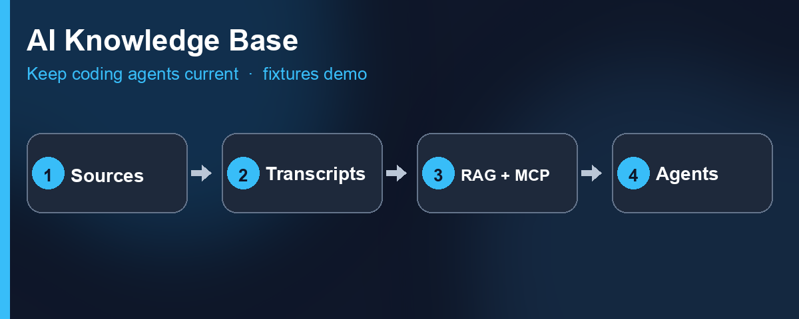
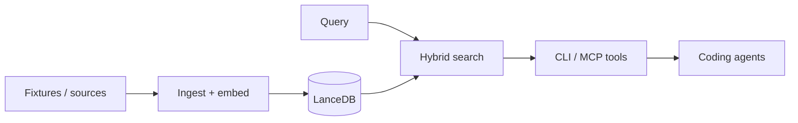

# AI Knowledge Base

Production-grade local **hybrid RAG** + **MCP** knowledge spine for coding agents.

Public demo runs on committed synthetic fixtures; the architecture and evaluation honesty are the product.



### The problem

AI techniques move weekly. Coding agents that only “know” training-cutoff defaults fall behind. Teams need a **local, citable** knowledge path — retrieve what matters, cite verified sources, and expose tools agents can safely call — without shipping proprietary corpora to external clouds or third parties.

This repository implements that retrieval spine locally: dual-leg retrieval (vector similarity + full-text search) fused via Reciprocal Rank Fusion (RRF), an optional cross-encoder reranking seam that degrades safely on failure, and a strictly read-only Model Context Protocol (MCP) server.

### How it works



1. Ingest documents (committed synthetic fixtures for the public demo).
2. Embed locally (Ollama `nomic-embed-text` @ 768).
3. Retrieve with **vector + keyword fusion** (RRF), with optional cross-encoder reranking.
4. Serve results via CLI and **read-only MCP** tools (`search`, `discover`, `get_context`, `get_status`).

### Key engineering decisions

1. **Hybrid fusion before cross-encoder** — the retrieval spine stays useful and fast if the reranker degrades, fails, or is disabled.
2. **Public fixtures / private corpus split** — strangers get an immediate, working demo; personal channels and corpora stay gitignored by design.
3. **MCP read-only by default** — mutation tools are isolated behind an explicit private profile flag (`AI_KB_MCP_PRIVATE=1`).
4. **Unvarnished eval honesty** — benchmark metrics report actual outcomes. Cross-encoder reranking is implemented and tested, but showed no measurable hit@K lift on ceilinged goldens and flat rejection on hard-negative traps. That result is documented rather than hidden; fail stays fail.

### Prerequisites

- Python 3.11+
- [`uv`](https://docs.astral.sh/uv/) **or** pip + venv (`python3 -m venv .venv && .venv/bin/pip install -e .`)
- [Ollama](https://ollama.com) running locally with `nomic-embed-text`
- Optional cross-encoder: `uv sync --extra ce` (or `pip install -e ".[ce]"`) for `sentence-transformers`

### Try it

```bash
uv sync
ollama pull nomic-embed-text
uv run python -m src.ingest --fixtures
uv run python -m src.search "reciprocal rank fusion RRF" --hybrid --db data/lancedb
uv run python -m src.eval
```

Same steps with pip/venv: skip `uv sync`, then run the modules with `.venv/bin/python` instead of `uv run python`.

To enable optional cross-encoder reranking, install the `ce` extra (`uv sync --extra ce` or `pip install -e ".[ce]"`), then pass `--ce` to `src.search` or set `AI_KB_CE=1`.

MCP wiring, discovery commands, and optional BYO YouTube overlay: [`GETTING_STARTED.md`](GETTING_STARTED.md). Dogfood with [mcp-audit](https://github.com/Alpha-W0lf/mcp-audit): `mcp-audit run --server "uv run python -m src.mcp_server"` (or `.venv/bin/python -m src.mcp_server`). Public tools advertise `readOnlyHint=true`.

### Stack

| Component | Tool |
|-----------|------|
| Vector + FTS | LanceDB |
| Embeddings | Ollama · `nomic-embed-text` @ 768 |
| Rerank (optional) | MiniLM cross-encoder (`[ce]` extra; degrades to fusion) |
| Agent surface | MCP (public profile = read-only) |

### Deeper docs

- [`docs/PORTFOLIO_VISION.md`](docs/PORTFOLIO_VISION.md) — packaging intent  
- [`docs/ARCHITECTURE.md`](docs/ARCHITECTURE.md) — contracts / how  
- [`GETTING_STARTED.md`](GETTING_STARTED.md) — operator path  
- [`FAQ.md`](FAQ.md) — Technical FAQ  
- [`SECURITY.md`](SECURITY.md) — Security policy and local-first probing notes  
- [`docs/2026-07-12_ce_keep_note.md`](docs/2026-07-12_ce_keep_note.md) — cross-encoder keep note  
- [`LICENSE`](LICENSE) — PolyForm Noncommercial 1.0.0 (source-available / non-commercial)  

Building agent knowledge systems? Reach me on [LinkedIn](https://www.linkedin.com/in/tchacko1/).
